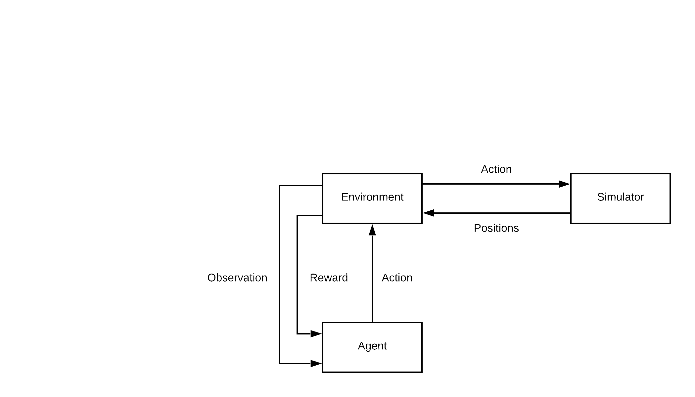
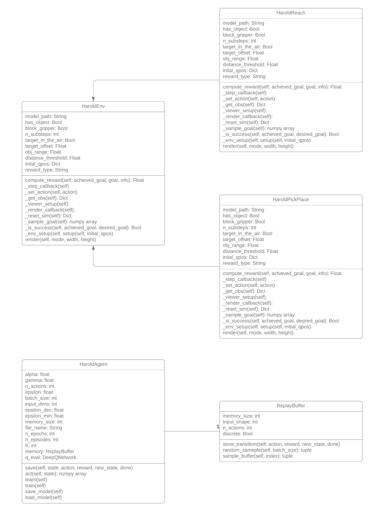

# Technical Specification

## Table of Contents

- [**1. Introduction**](#1-introduction)
  - [1.1 Overview](#11-overview)
  - [1.2 Glossary](#12-glossary)
- [**2. System Architecture**](#2-system-architecture)
- [**3. High-Level Design**](#3-high-level-design)
- [**4. Problems and Resolution**](#4-problems-and-resolution)
- [**5. Installation Guide**](#5-installation-guide)

## 1. Introduction

### 1.1. Overview

H.A.R.O.L.D is a machine learning-driven robotic arm. Typically robotic arms make use of a P.I.D controller, this controls movement. By replacing the P.I.D controller with a Machine Learning Algorithm we can potentially create more efficient routines. This arm is coupled with an easy to use G.U.I can be easily picked up by given users of all technical ability.

### 1.2. Glossary

#### **GUI**

GUI stands for Guided User Interface. This encompasses all mouse/ touch-driven interactions with a given program.

#### **Machine Learning**

Machine Learning is one area of artificial intelligence. The idea is to be able to train a system to complete a given instruction without explicitly stating how.

#### **Neural Network**

A Neural Network is the backbone of a machine learning algorithm. It is comprised of layers, each layer contains some number of nodes interconnected with nodes in the prior and proceeding layers.

#### **Reinforcement Learning**

Reinforcement learning is a subset of machine learning. The goal is to train an artificial neural network by observing actions and then rewarding good behaviour while penalizing bad behaviour. Typically there is an Agent which interacts with an Environment. This back-and-forth between Agent and Environment allows us to populate a Q-Table with information.

#### **Agent**

An Agent is an interface between a neural network and all other training. It is responsible for choosing actions.

### **Environment**

An Environment takes actions from the Agent and is responsible for calculating rewards as well as putting into motion, any action that the Agent chose.

### **Bounding Box**

A box that surrounds an object on the screen.

### **Q-Table**

A Q-Table is a table where the columns denote all possible actions that an Agent can take. Each row then denotes a state that the Agent is in. Finally, each cell holds a probability for success if the Agent chooses a particular action when the Environment is in a given state.

## 2. System Architecture

### Language

We chose Python 3.8 as the backbone for the project. This was mainly because it allowed up to make use of many of the libraries developed for Machine Learning and computer vision. Below we will go into more detail on the libraries being used.

### Gym

The gym is a Reinforcement Learning library from OpenAi. This library allowed was the backbone of our environment code.

### Tensorflow/ Keras

Tensorflow is a library from Google for designing Neural Networks, with Keras being a set of python bindings.

### OpenCv

OpenCV is a computer vision library. This is what we used to handle camera feed and creating bounding boxes over detected objects.

### Architecture Diagram

Our System can be broken down into three distinct areas.

1. User Space,
2. Physical Space, and
3. Network Space

Below depicts a high-level view of how our system is laid out.


#### User Space

User Space is the area in which a person would spend most of their time when operating the system. This interaction will be done through the G.U.I. The G.U.I receive the video feed of both camera objects and supplies these objects with a path and viewpoint.

When it comes time pick-and-place an object, 2 vectors are sent to the Neural Network. 

#### Physical Space

The physical space encompasses all hardware devices associated with this project. This would be are two cameras and a robotic arm. The robotic arm only receives commands from the Neural Network.

#### Network Space

Network Space contains all areas related to our Neural Network. As stated above, two vectors are given to the Neural Network, These vectors correspond to the objects original location, and it's desired location. The Neural Network will then send commands to the arm until the task is complete.

Training is handled by the Agent/ Environment loop described in the Glossary and depicted below.

## 3. High-Level Design

### 3.1. Data Flow Diagram



### 3.2. UML Diagram



### Context Diagram


## 4. Problems and Resolution

### Boundary Box Disappearance

When creating a bounding box, originally we tried using one of the methods for finding the difference between images in OpenCV. This is due to the method checking the comparing the most recent frame to the frame immediately before it. To resolve this, we require the user to clear the area of operation so that a static background frame can be set.

## 5. Installation Guide

### Step 0: Make your robot arm

The robotic arm that this project was created around is can be found here: [Build a Giant 3D Printed Robot Arm](https://www.instructables.com/id/Build-a-Giant-3D-Printed-Robot-Arm/).

### Step 1: Clone the repository

Open a terminal and paste in the following

```git clone https://gitlab.computing.dcu.ie/devina24/2020-ca326-devina24-harold.git```

### Step 2: Download the dependencies

Navigate into the code directory by entering the following into your terminal

```cd 2020-ca326-devina24-harold.git/code/```

To install the prerequisite dependencies, enter the following.

```pip install -r requirements.txt```

This will parse through the requirements.txt file and download all the third party modules used in this project.

### Step 3: Connect your cameras

Plugin you webcams into your computer.
Note: This project has been developed around the Sony Play Station Eye cameras, therefore any off behaviour with regards to Object detections may be as a result of that.

### Step 4: Connect the robotic arm

TBD