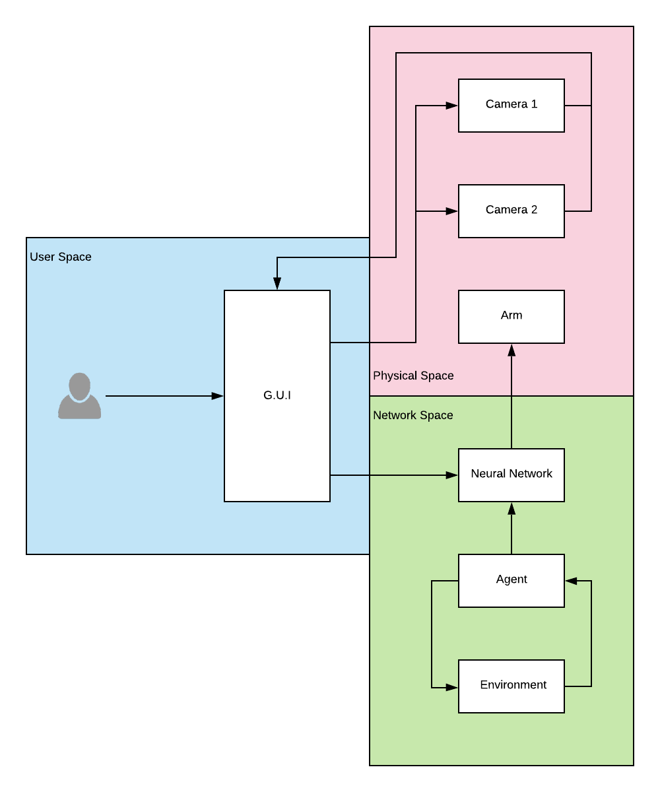
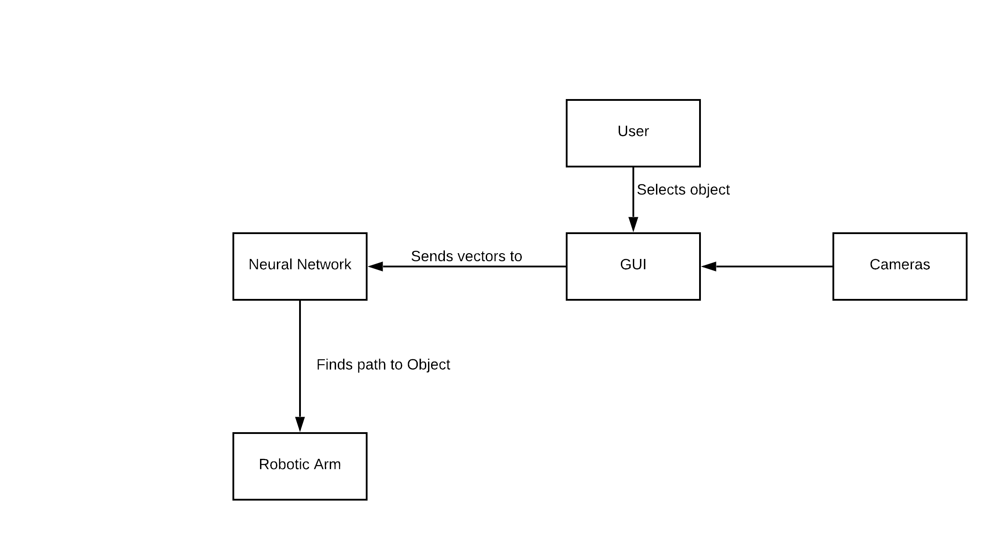

# Technical Specification

## Table of Contents

- [**1. Introduction**](#1-introduction)
  - [1.1 Overview](#11-overview)
  - [1.2 Glossary](#12-glossary)
- [**2. System Architecture**](#2-system-architecture)
- [**3. High-Level Design**](#3-high-level-design)
- [**4. Problems and Resolution**](#4-problems-and-resolution)
- [**5. Installation Guide**](#5-installation-guide)

## 1. Introduction

### 1.1. Overview

H.A.R.O.L.D is an machine learning driven robotic arm. Typically robotic arms make use of a P.I.D controller, this controls movement. By replacing the P.I.D controller with a Machine Learning Algorithm we can potentially create more efficient routines. This arm is coupled with an easy to use G.U.I which can be easily picked up by user's of all technical ability.

### 1.2. Glossary

#### **GUI**

GUI stands for Guided User Interface. This encompasses all mouse/ touch driven interactions with a given program.

#### **Machine Learning**

Machine Learning is one area of artificial intelligence. The idea is to be able to train a system to complete a given instruction without explicitly stating how.

#### **Neural Network**

A Neural Network is the backbone of a machine learning algorithm. It is comprised of layers, each layer contains some number of nodes interconnected with nodes in the prior and proceeding layers.

#### **Reinforcement Learning**

Reinforcement learning is a subset of machine learning. The goal is to train an artificial neural network by observing actions and then rewarding good behavior while penalizing bad behavior. Typically there is an Agent which interacts with an Environment. This back-and-forth between Agent and Environment allows us to populate a Q-Table with information.

#### **Agent**

An Agent is the interface between a neural network and all other training. It is responsible for choosing actions.

### **Environment**

### **Bounding Box**

A box that surrounds an object on screen.

### **Q-Table**

A Q-Table is table where the columns denote all possible actions that an Agent can take. Each row then denotes a state that the Agent is in. Finally each cell holds a probability for success if the Agent is chooses a particular action when the Environment is in a given state.

## 2. System Architecture

### Language

We chose python 3.8 as the backbone for the project. This was mainly because it allowed up to make use of many of the libraries developed for Machine Learning and computer vision. Below we will go into more detail on the libraries being used.

### Gym

Gym is a Reinforcement Learning library from OpenAi. This library allowed was the backbone of our environment code.

### Tensorflow/ Keras

Tensorflow is a library from Google for designing Neural Networks, with Keras being a set of python bindings.

### OpenCv

OpenCv is a computer vision library. This is what we used to handel camera feed and creating boundary box's over detected objects.

### Architecture Diagram

Our System can be broken down into three distinct areas.

1. User Space,
2. Physical Space, and
3. Network Space

Below depicts a high-level view of how our system is layed out.

#### User Space

#### Physical Space

The physical space encompasses all hardware devices associated with this project.

#### Network Space

Network Space contains all areas related to our Neural Network.

## 3. High-Level Design

### 3.1. Data Flow Diagram

### 3.2. UML Diagram

### Context Diagram

## 4. Problems and Resolution

## 5. Installation Guide
