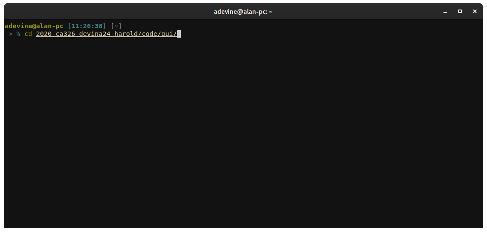
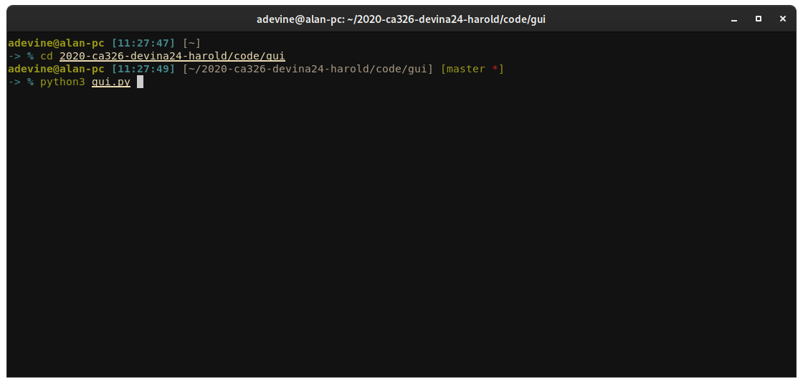
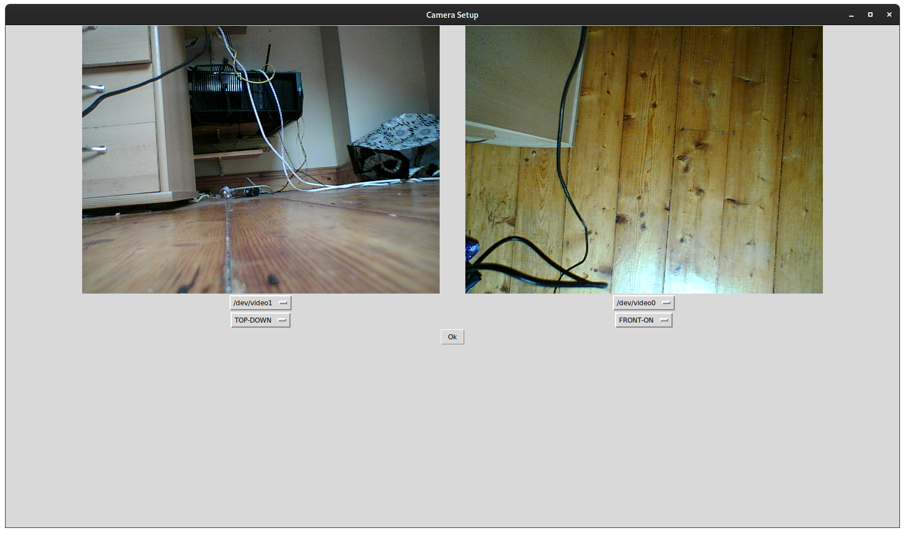
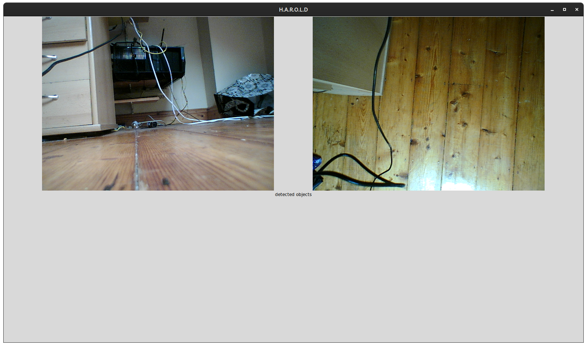
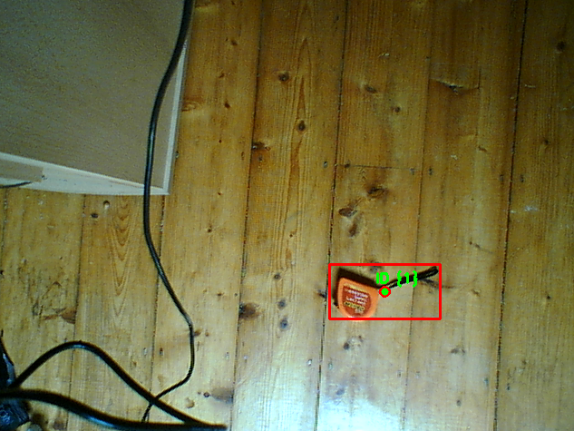
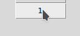
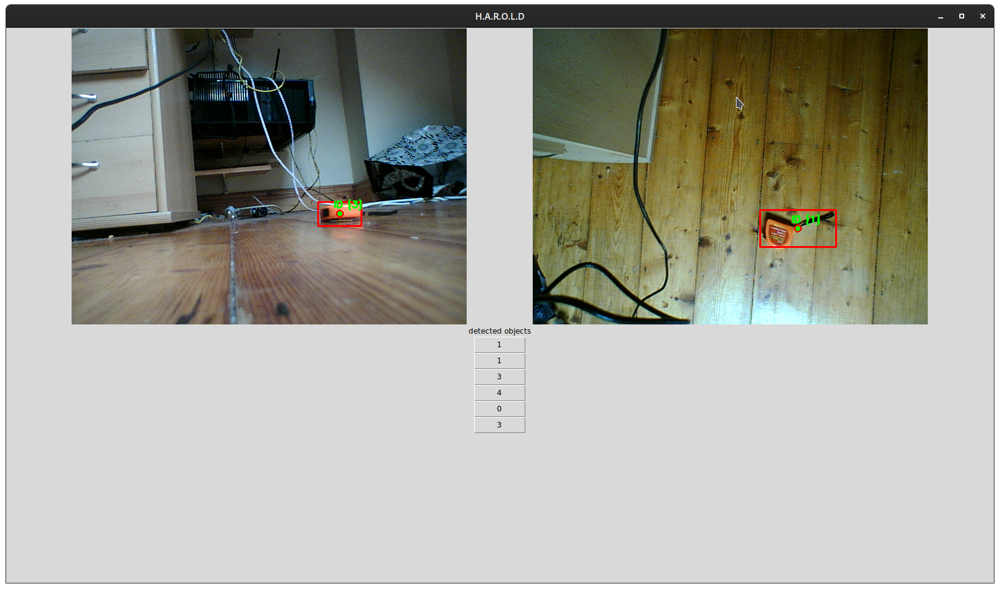

# H.A.R.O.L.D - User Manual

Start by navigating to gui.py this can be done by entering the following command into your terminal.

Now you can run the program by entering the following

when you run gui.py, you will be presented with the screen below. this is our camera setup screen. as you can see there is two camera view, below these views are dropdown menus of the camera's detected by your machine. select the cameras that are to be used in operation.

next, select the type of view that the camera holds. this can be selected by using the dropdown menu indicated below. Now that your cameras have been set up, make sure that your area of operation has been cleared, this crucial as if not, the system will register more objects than there are screen. once the area is clear you can now click "Ok".

The main screen will now appear.

Now place an object into frame, you will see that the object will be surrounded by a red square with the center being highlighted.

You will also notice that buttons have started populating the middle of the screen, these correspond to the object id's visible in the camera feed select one of these buttons.

Select one of these buttons then click on the where you want the object to be moved to

